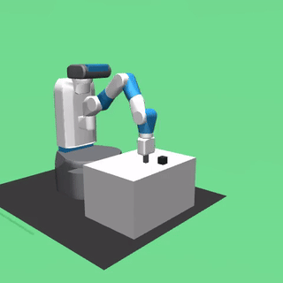

# Technical Assessment: Robotics Research Intern — RL for Robot Control

> **⚠️ IMPORTANT — READ BEFORE YOU START ⚠️**
>
> **Please read this entire document carefully before beginning any work.** This README contains critical information about the task requirements, environment setup, HER implementation guidelines, expected file formats, and hyperparameter recommendations. Skipping sections may lead to wasted time, broken setups, or missing deliverables. A thorough read-through will ensure a smooth experience and help you avoid common pitfalls.

## Overview

This assessment evaluates your ability to apply **reinforcement learning** to **robotic manipulation**. You will train RL agents to control a 7-DOF Fetch robot arm to push an object to a target location — a task that is **unsolvable with standard RL** due to its sparse reward structure. The core challenge is implementing **Hindsight Experience Replay (HER)** from scratch, then using it to compare SAC vs DDPG, design custom reward functions, and evaluate policy robustness.

**Time limit:** 10 days from receipt
**Compute requirements:** Designed to run on **CPU or free GPU resources** — Google Colab or Kaggle. Each training run takes ~1-3 hours on CPU. No paid compute is required.

<table>
<tr>
<td align="center"><b>Without HER (random baseline)</b></td>
<td align="center"><b>With SAC + HER (trained policy)</b></td>
</tr>
<tr>
<td align="center"></td>
<td align="center"></td>
</tr>
<tr>
<td align="center">~5% success rate</td>
<td align="center">~99% success rate</td>
</tr>
</table>

---

## Background

### Reinforcement Learning for Robot Control

Reinforcement learning (RL) trains agents to make sequential decisions by maximizing cumulative reward through trial and error. In robotics, RL is used to learn control policies that map sensor observations to motor commands — without explicitly programming the behavior.

### The Goal-Conditioned RL Problem

Many robotic tasks are **goal-conditioned**: the agent must achieve a specific goal (e.g., move an object to a target position) that changes every episode. The natural reward is **sparse** — "did you achieve the goal?" (0 or -1). This creates a severe exploration problem: with random actions, the agent almost never reaches the goal, so it never sees positive reward and cannot learn.

This is a fundamental challenge in robotics RL that motivates advanced techniques like HER.

### Hindsight Experience Replay (HER)

**HER** (Andrychowicz et al., NeurIPS 2017) is an elegant solution to the sparse-reward problem in goal-conditioned RL. The key insight: **a failed attempt is a successful attempt at a different goal**.

When an episode fails to achieve the desired goal, HER retroactively replaces the desired goal with the goal that was actually achieved (the final object position). This creates "virtual successes" that provide learning signal even from failed episodes.

Concretely, HER uses the **"future" strategy**:
- For each transition `(s_t, a_t, r_t, s_{t+1})` in a failed episode
- Sample `k` future timesteps `t' > t` from the same episode
- Replace the desired goal with the achieved goal at timestep `t'`
- Recompute the reward using the new goal
- Store these relabeled transitions alongside the original ones

With `k=4`, roughly 80% of transitions in the buffer are HER-relabeled "successes", dramatically accelerating learning.

**HER requires off-policy algorithms** (SAC, DDPG) because it modifies past transitions in the replay buffer — on-policy algorithms (PPO) cannot use HER.

### SAC vs DDPG

The two dominant off-policy algorithms for continuous robot control:

| Algorithm | Key Properties |
|-----------|---------------|
| **SAC** (Soft Actor-Critic) | Stochastic policy, entropy-regularized. More stable and robust due to entropy bonus. Two Q-networks for reduced overestimation. |
| **DDPG** (Deep Deterministic Policy Gradient) | Deterministic policy + exploration noise. Simpler architecture. Can be brittle but often faster per step. |

Both algorithms use a replay buffer and learn from past experience — making them compatible with HER. Understanding *when and why* to choose one over the other is a core RL skill.

### The Reward Engineering Problem

Even with HER, the **reward function** significantly affects learning speed and final behavior. A sparse reward with HER works but may be slow. A well-designed dense reward can accelerate training and produce smoother, more efficient behavior — but can also introduce reward hacking if not carefully designed.

When combined with HER, reward engineering becomes more nuanced: the reward must be recomputable from only the achieved goal and desired goal (since HER relabels goals after the fact).

### Sim-to-Real and Domain Randomization

Policies trained in simulation often fail on real hardware because the simulator doesn't perfectly match reality — there are gaps in physics parameters (friction, mass, damping).

**Domain randomization** addresses this by training on a *distribution* of environments: randomize physics parameters during training so the policy learns to be robust to variations.

### FetchPush Environment

**FetchPush** (from Gymnasium-Robotics) is a robotic manipulation task using a 7-DOF Fetch robot arm:

- **Objective:** Push a cube on a table to a target position
- **Observation:** 31-dim flattened vector — robot joint positions/velocities, gripper state, object position/velocity, desired goal, achieved goal
- **Action:** 4-dim continuous — 3D end-effector velocity + gripper command
- **Default reward:** Sparse — returns `0` if object is within 5cm of goal, `-1` otherwise
- **Episode length:** 50 timesteps

**Observation layout (31-dim):**
```
[0:25]  - robot observation (joint pos, velocities, gripper, object state)
[25:28] - desired_goal (target x, y, z)
[28:31] - achieved_goal (current object x, y, z)
```

**Why FetchPush needs HER:** With sparse reward, random actions achieve the goal ~5% of the time (lucky initial configurations). Standard SAC/DDPG cannot learn from this signal. HER transforms this problem from nearly impossible to solvable.

### CleanRL

**CleanRL** is a library of single-file RL algorithm implementations. Unlike high-level libraries, CleanRL gives you the entire algorithm in one readable file — making it easy to understand, modify, and debug. It has built-in Wandb support for experiment tracking.

We provide pre-adapted SAC and DDPG scripts for the FetchPush environment. Your main task is implementing HER and integrating it with these scripts.

---

## Task Description

### Part A: Environment Setup, Baselines & HER Implementation (40 points)

#### 1. Set up the environment (5 points)

- Install Gymnasium-Robotics, MuJoCo, and CleanRL dependencies
- Verify FetchPush runs headlessly
- The custom `FetchPushFlat-v0` wrapper is provided in `scripts/fetch_push_env.py`
- Set up Weights & Biases (Wandb) for experiment tracking

#### 2. Train a baseline without HER (5 points)

Train SAC on FetchPush with the **default sparse reward** and **no HER**:
- Observe that it achieves ~5% success rate (random baseline)
- This demonstrates *why* HER is needed for sparse-reward goal-conditioned tasks
- Log to Wandb and save results

#### 3. Implement Hindsight Experience Replay (20 points)

**This is the core of the assessment.** Implement HER from scratch in `scripts/her_replay_buffer.py`.

We provide a skeleton file with:
- The `HERReplayBuffer` class with constructor, type hints, and docstrings
- Method signatures: `store_episode()`, `_sample_her_goals()`, `_recompute_reward()`, `sample()`, `__len__()`
- Detailed TODO comments explaining what each method should do
- The `ReplayBufferSamples` NamedTuple for compatibility with the training scripts

**What you implement:**

| Method | What It Does |
|--------|-------------|
| `__init__` | Initialize episode storage and transition tracking |
| `store_episode()` | Store a complete episode; handle buffer overflow (FIFO) |
| `_sample_her_goals()` | Sample virtual goals using the "future" strategy |
| `_recompute_reward()` | Recompute reward using `compute_reward_static` after goal relabeling |
| `sample()` | Sample batch with HER relabeling (k/(k+1) probability) |

**Integration:** Wire your HER buffer into the provided SAC and DDPG scripts. Both scripts have `--her` flag and TODO comments showing where to integrate. The HER buffer's `sample()` returns the same `ReplayBufferSamples` NamedTuple, so the training loop doesn't change.

**Key hyperparameters for HER:** The provided scripts have pre-tuned defaults for FetchPush+HER (`gamma=0.95`, `tau=0.05`, `random_eps=0.3`, `exploration_noise=0.2`). These are critical — especially `random_eps` which ensures sufficient exploration to contact the object. Both scripts also support `--gradient-steps N` if you want to experiment with more gradient updates per environment step (the original HER paper uses 40).

**Validation:** After implementing HER, train SAC+HER for 250K steps and verify success rate jumps from ~5% to >50% (typically starts improving around 60-80K steps).

#### 4. Set up Wandb logging (10 points)

- Create a free Wandb account at [wandb.ai](https://wandb.ai)
- Log all training runs with `--track --wandb-project-name rl-fetch-push`
- Training curves (reward, success rate) must be clearly visible
- Multiple runs must be labeled and organized

**Deliverables for Part A:**
- Working training commands (fully reproducible)
- Wandb project link with all training curves
- `results/sac_baseline_results.json` — SAC without HER (~5% success)
- `results/sac_her_results.json` — SAC with HER (target: >50% success)
- `scripts/her_replay_buffer.py` — Your HER implementation

---

### Part B: Reward Engineering & Algorithm Comparison (30 points)

#### Reward Engineering (15 points)

With HER, even sparse reward works. But better reward functions can **accelerate training** and produce **higher-quality behavior** (smoother, more energy-efficient, faster task completion).

Design **at least 2 custom reward functions** that improve upon the sparse baseline when used with HER. Implement them in `scripts/fetch_push_env.py` by adding new `reward_type` options.

**Important:** When using HER, your reward function must be recomputable from `(achieved_goal, desired_goal)` alone — add it to `compute_reward_static()`. If your reward uses additional state (e.g., action, velocity), those components will only apply to the original (non-relabeled) transitions.

**Reward objectives** — your custom rewards should address at least two of:

| Objective | What to reward/penalize | Why it matters |
|-----------|------------------------|----------------|
| **Dense distance** | Negative L2 distance from object to goal | Provides continuous gradient toward goal, faster than sparse alone |
| **Approach + push** | Reward gripper→object distance, then object→goal distance | Two-phase structure guides the agent's approach behavior |
| **Energy efficiency** | Penalize L2 norm of actions, penalize jerky movements | Real actuators have torque limits; smoother policies transfer better |
| **Progress bonus** | Reward reduction in object-goal distance between timesteps | Rewards movement in the right direction, not just proximity |

For each reward variant, train with SAC+HER and save results as `results/reward_{variant_name}_sac_her_results.json`.

#### Algorithm Comparison: SAC+HER vs DDPG+HER (15 points)

Using your **best reward function**, compare SAC and DDPG — both with HER:

- Train both algorithms with the same reward and same number of timesteps
- Use the provided `scripts/sac_fetchpush.py` and `scripts/ddpg_fetchpush.py`
- Compare: success rate, sample efficiency (reward vs timesteps), training wall time, final behavior quality
- Save results as `results/sac_her_best_reward_results.json` and `results/ddpg_her_best_reward_results.json`

**Deliverables for Part B:**
- Custom reward implementations in `scripts/fetch_push_env.py` (code + `compute_reward_static`)
- `results/reward_*_sac_her_results.json` — one per reward variant
- `results/sac_her_best_reward_results.json` and `results/ddpg_her_best_reward_results.json`

---

### Part C: Robustness, Domain Randomization & Technical Report (30 points)

#### Robustness Evaluation (8 points)

Take your **best policy** (best algorithm + best reward + HER) and evaluate it under domain shifts:

| Parameter | Nominal | Test Values |
|-----------|---------|-------------|
| `object_mass_multiplier` | 1.0 | 0.5, 1.0, 1.5, 2.0 |
| `friction_multiplier` | 1.0 | 0.5, 1.0, 1.5, 2.0 |
| `object_size_multiplier` | 1.0 | 0.8, 1.0, 1.2 |

Evaluate on each combination (or a representative subset) and report how success rate degrades.

#### Domain Randomization Training (7 points)

Train a new policy with **domain randomization enabled** during training:
- Randomize object mass, friction, and size at each episode reset
- Use the same algorithm and reward function as your best nominal policy
- Compare the DR-trained policy vs the nominal-trained policy under the same domain shifts

#### Technical Report — Paper Format (15 points)

Submit a **PDF report** (`REPORT.pdf`) written in the style of a short research paper.

**Required sections:**

1. **Abstract** (0.5 page)
   - Summarize your objectives, approach, key findings, and one takeaway.

2. **Introduction & Background** (0.5-1 page)
   - Context on goal-conditioned RL, sparse rewards, and HER.
   - State what you investigated and why.

3. **Method: HER Implementation** (1 page)
   - Describe your HER implementation: data structures, relabeling procedure, reward recomputation.
   - Explain the "future" strategy and why it works.
   - Discuss key design decisions (e.g., handling edge cases, buffer management).

4. **Experimental Setup** (0.5-1 page)
   - Environment details, algorithm configurations, hardware.
   - Describe your reward functions: formulation, motivation, expected behavior.

5. **Results** (1-2 pages)
   - **Table 1:** Before vs After HER — success rate with and without HER.
   - **Table 2:** Reward comparison — success rate for each reward variant with HER.
   - **Table 3:** SAC+HER vs DDPG+HER comparison.
   - **Table 4:** Robustness — success rate under domain shifts (nominal vs DR-trained).
   - **Figures from Wandb:** Training curves for all experiments.

6. **Analysis & Discussion** (1-2 pages)
   - **HER analysis:** Why does HER transform the problem? How does the number of relabeled goals (k) affect performance?
   - **Reward design analysis:** Why does your best reward improve over sparse+HER?
   - **SAC vs DDPG:** Connect performance differences to algorithmic properties (stochastic vs deterministic policy, entropy regularization, exploration strategies).
   - **Robustness analysis:** Which domain shifts hurt most, and why?
   - **Video analysis:** Reference specific moments from simulation videos. Identify failure modes.

7. **Proposed Improvement** (0.5 page)
   - One concrete, technically grounded approach to improve performance or robustness.
   - Must be motivated by YOUR experiments.

8. **References**

**Report guidelines:**
- **Length:** 4-8 pages (including figures and tables, excluding references)
- **Format:** PDF. Use LaTeX, Google Docs, Overleaf, or any tool.
- **Figures:** All plots must have labeled axes, titles, and legends.
- **Writing:** Clear, concise, technical.

---

## Repository Structure

```
your-submission/
├── README.md                                 # How to reproduce your results
├── REPORT.pdf                                # Technical report (paper format) — Part C
├── SUBMISSION.md                             # Filled-in submission template
├── results/
│   ├── sac_baseline_results.json             # SAC without HER (baseline ~5%)
│   ├── sac_her_results.json                  # SAC with HER (target >50%)
│   ├── reward_{variant}_sac_her_results.json # Custom rewards with HER
│   ├── sac_her_best_reward_results.json      # SAC+HER with best reward
│   ├── ddpg_her_best_reward_results.json     # DDPG+HER with best reward
│   ├── robustness_nominal_*.json             # Robustness eval (nominal-trained)
│   └── robustness_dr_*.json                  # Robustness eval (DR-trained)
├── videos/
│   ├── sac_no_her_failure.mp4
│   ├── sac_her_success.mp4
│   └── ...
├── scripts/
│   ├── fetch_push_env.py                     # Environment wrapper (modify reward here)
│   ├── her_replay_buffer.py                  # YOUR HER implementation
│   ├── sac_fetchpush.py                      # SAC training script (pre-adapted)
│   ├── ddpg_fetchpush.py                     # DDPG training script (pre-adapted)
│   ├── evaluate_policy.py                    # Evaluation and JSON output
│   └── cleanrl_utils/buffers.py              # CleanRL replay buffer (provided)
├── figures/
│   ├── her_impact.png
│   ├── reward_comparison.png
│   └── ...
├── configs/
└── logs/
```

### What We Look At (in order)

1. **`scripts/her_replay_buffer.py`** — your HER implementation. Most important code deliverable.
2. **`REPORT.pdf`** — your technical report with HER analysis.
3. **`scripts/fetch_push_env.py`** — your reward function implementations.
4. **`results/*.json`** — automated scoring on these.
5. **`videos/`** — we watch your robot succeed and fail.
6. **Wandb dashboard** — verify training happened, review curves.
7. **Git history** — iterative progress, not a single commit dump.

---

## Evaluation Criteria

| Component | Points | Scoring Method |
|-----------|--------|----------------|
| **Part A: Setup, Baselines & HER** | 40 | |
| - Environment setup & reproducibility | 5 | Manual review |
| - SAC baseline without HER | 5 | Automated |
| - HER implementation (correctness + code quality) | 20 | Manual + automated |
| - Wandb logging with visible training curves | 10 | Manual (link check) |
| **Part B: Reward Engineering & Algo Comparison** | 30 | |
| - Custom reward variants (>= 2) with results | 8 | Automated + manual |
| - Best reward success rate improvement | 7 | Automated |
| - SAC+HER vs DDPG+HER comparison results | 10 | Automated |
| - Reward function code quality | 5 | Manual |
| **Part C: Robustness & Report** | 30 | |
| - Robustness evaluation under domain shifts | 8 | Automated + manual |
| - Domain randomization training comparison | 7 | Automated + manual |
| - Technical report quality (HER analysis, comparisons) | 15 | Manual rubric |
| **Total** | **100** | |

### HER Implementation Scoring (20 points)

| Criteria | Points |
|----------|--------|
| Correct episode storage with FIFO overflow handling | 3 |
| Correct "future" strategy goal sampling | 4 |
| Correct reward recomputation using `compute_reward_static` | 3 |
| Correct HER relabeling in `sample()` with k/(k+1) probability | 5 |
| Working integration with SAC/DDPG training scripts | 3 |
| Code quality: readable, well-commented, efficient | 2 |

### Report Scoring (15 points)

| Criteria | Points |
|----------|--------|
| Clear structure following required sections | 2 |
| HER implementation analysis (how it works, why it's needed, design choices) | 4 |
| Reward design rationale and formulation | 3 |
| SAC vs DDPG analysis connecting to algorithmic properties | 3 |
| Robustness analysis + video analysis + proposed improvement | 3 |

---

## Setup Guide

### Step 1: Environment

```bash
# Create a virtual environment
python -m venv venv
source venv/bin/activate

# Install core dependencies
pip install gymnasium[mujoco] gymnasium-robotics
pip install torch  # CPU is sufficient for this assessment

# Install CleanRL dependencies
pip install tyro wandb tensorboard

# CleanRL's replay buffer utility (required by SAC and DDPG scripts)
mkdir -p cleanrl_utils && touch cleanrl_utils/__init__.py
curl -sL "https://raw.githubusercontent.com/vwxyzjn/cleanrl/master/cleanrl_utils/buffers.py" \
  -o cleanrl_utils/buffers.py

# Login to Wandb
wandb login

# Verify installation
python -c "
import gymnasium as gym
import gymnasium_robotics
gym.register_envs(gymnasium_robotics)
env = gym.make('FetchPush-v4')
obs, info = env.reset()
print(f'Observation keys: {obs.keys()}')
print(f'Observation shape: {obs[\"observation\"].shape}')
print(f'Goal shape: {obs[\"desired_goal\"].shape}')
print(f'Action shape: {env.action_space.shape}')
print('All imports OK')
"
```

### Step 2: Verify the Custom Environment

```python
from scripts.fetch_push_env import register_fetch_push_envs
register_fetch_push_envs()

import gymnasium as gym
env = gym.make("FetchPushFlat-v0", reward_type="sparse")
obs, info = env.reset()
print(f"Flat observation shape: {obs.shape}")  # (31,)
print(f"Action space: {env.action_space}")      # Box(-1, 1, (4,))
```

### Step 3: Train SAC Baseline (without HER)

```bash
# This will show ~5% success rate — demonstrating why HER is needed
python scripts/sac_fetchpush.py \
  --reward-type sparse \
  --total-timesteps 250000 \
  --track \
  --wandb-project-name rl-fetch-push \
  --exp-name sac-baseline-no-her \
  --seed 42
```

### Step 4: Implement HER

Edit `scripts/her_replay_buffer.py` — implement the TODO methods. Then integrate with the training scripts:

1. In `sac_fetchpush.py` and `ddpg_fetchpush.py`, the `--her` flag sections have TODO comments
2. Import your `HERReplayBuffer` and replace the standard `ReplayBuffer`
3. Add episode collection: accumulate transitions, call `store_episode()` at episode end

### Step 5: Train with HER

```bash
# SAC with HER — should achieve >50% success rate
python scripts/sac_fetchpush.py \
  --reward-type sparse \
  --her \
  --total-timesteps 250000 \
  --track \
  --wandb-project-name rl-fetch-push \
  --exp-name sac-her-sparse \
  --seed 42

# DDPG with HER
python scripts/ddpg_fetchpush.py \
  --reward-type sparse \
  --her \
  --total-timesteps 250000 \
  --track \
  --wandb-project-name rl-fetch-push \
  --exp-name ddpg-her-sparse \
  --seed 42
```

### Step 6: Evaluation

Use `scripts/evaluate_policy.py` to evaluate trained policies and generate result JSONs:

```bash
python scripts/evaluate_policy.py \
  --model-path runs/<run-name>/sac_fetchpush.cleanrl_model \
  --env-id FetchPushFlat-v0 \
  --reward-type sparse \
  --algorithm SAC \
  --n-episodes 100 \
  --output results/sac_her_results.json \
  --record-video \
  --video-dir videos/
```

> **Note:** You'll need to adapt the model loading in `evaluate_policy.py` to reconstruct the Actor class and call `load_state_dict()`. The script provides the basic pattern.

### Step 7: Domain Randomization

Train with randomized physics:
```bash
python scripts/sac_fetchpush.py \
  --reward-type your_best_reward \
  --her \
  --total-timesteps 500000 \
  --track \
  --wandb-project-name rl-fetch-push \
  --exp-name sac-her-dr \
  --seed 42
# (modify make_env to pass randomize=True, mass_range=[0.5, 2.0], etc.)
```

Evaluate under domain shifts:
```bash
python scripts/evaluate_policy.py \
  --model-path runs/<run-name>/sac_fetchpush.cleanrl_model \
  --env-id FetchPushFlat-v0 \
  --reward-type your_best_reward \
  --algorithm SAC \
  --object-mass-multiplier 2.0 \
  --n-episodes 50 \
  --output results/robustness_nominal_mass_2x.json
```

---

## Results JSON Format

All result files must follow this schema:

```json
{
  "experiment": "sac_her_sparse",
  "algorithm": "SAC",
  "reward_type": "sparse",
  "env_id": "FetchPushFlat-v0",
  "success_rate": 0.85,
  "mean_episode_return": -8.5,
  "mean_episode_length": 42.3,
  "mean_energy": 0.45,
  "total_timesteps": 250000,
  "training_wall_time_minutes": 120.0,
  "n_eval_episodes": 100,
  "domain_randomization": {
    "object_mass_multiplier": 1.0,
    "friction_multiplier": 1.0,
    "object_size_multiplier": 1.0
  },
  "hardware": "Google Colab CPU / NVIDIA T4",
  "seed": 42,
  "notes": ""
}
```

---

## External Resources

### Core References — Must Read

| Resource | Why Read It |
|----------|------------|
| [HER Paper (Andrychowicz et al., 2017)](https://arxiv.org/abs/1707.01495) | **The paper you're implementing.** Read Sections 1-4 carefully. |
| [CleanRL Documentation](https://docs.cleanrl.dev/) | **Your RL framework.** Read the SAC and DDPG implementation details. |
| [Gymnasium-Robotics Fetch Docs](https://robotics.farama.org/envs/fetch/) | **Your environment.** Observation/action spaces, task descriptions. |
| [Spinning Up in Deep RL (OpenAI)](https://spinningup.openai.com/) | Excellent RL fundamentals. SAC and DDPG explanations. |

### Reward Engineering

| Resource | Description |
|----------|-------------|
| [Reward Shaping (Ng et al., 1999)](https://people.eecs.berkeley.edu/~pabbeel/cs287-fa09/readings/NgHaradaRussell-shaping-ICML1999.pdf) | Potential-based reward shaping theory. |
| [Multi-Goal RL (Plappert et al., 2018)](https://arxiv.org/abs/1802.09464) | OpenAI's work combining HER with multi-goal environments — directly relevant. |

### SAC, DDPG, and HER

| Resource | Description |
|----------|-------------|
| [SAC Paper (Haarnoja et al., 2018)](https://arxiv.org/abs/1801.01290) | Soft Actor-Critic. |
| [DDPG Paper (Lillicrap et al., 2015)](https://arxiv.org/abs/1509.02971) | Deep Deterministic Policy Gradient. |
| [HER Paper (Andrychowicz et al., 2017)](https://arxiv.org/abs/1707.01495) | Hindsight Experience Replay. |

### Domain Randomization & Sim-to-Real

| Resource | Description |
|----------|-------------|
| [Domain Randomization (Tobin et al., 2017)](https://arxiv.org/abs/1703.06907) | The original domain randomization paper. |
| [Sim-to-Real Locomotion (Hwangbo et al., 2019)](https://arxiv.org/abs/1901.08652) | Physics randomization for quadruped control. |

### Background

| Topic | Resource |
|-------|----------|
| RL fundamentals | [Sutton & Barto (free online)](http://incompleteideas.net/book/the-book-2nd.html) |
| MuJoCo physics | [MuJoCo Documentation](https://mujoco.readthedocs.io/) |
| Gymnasium basics | [Gymnasium Documentation](https://gymnasium.farama.org/) |

---

## Compute Tips

### Training Time Estimates

| Experiment | Timesteps | CPU Time |
|-----------|-----------|----------|
| SAC baseline (no HER) | 250K | ~1.5 hours |
| SAC + HER (sparse) | 250K | ~1.5 hours |
| SAC + HER (custom reward) | 250K | ~1.5 hours |
| DDPG + HER (best reward) | 250K | ~1.5 hours |
| DR training | 500K | ~3 hours |
| **Total (all experiments)** | ~1.5M | **~9-12 hours** |

### Important Notes

- **SAC and DDPG run at ~45 steps/sec on CPU.** This is normal for off-policy algorithms with replay buffers.
- **HER adds minimal overhead.** The relabeling happens during sampling, not during environment interaction.
- **Start with 250K timesteps.** SAC+HER should show significant learning by 80K steps (success rate rises from ~5% to >50%). By 200K steps expect >90%.
- **Multiple seeds recommended.** RL results are noisy. Train key experiments with 3 seeds and report mean +/- std.
- **CleanRL captures video automatically** with `--capture-video`.
- **Without HER, expect ~5% success.** This is the random baseline. Don't waste time tuning hyperparameters without HER — implement HER first.
- **DDPG may struggle more than SAC.** The original HER paper uses DDPG with 3 hidden layers + layer normalization. If your DDPG+HER isn't learning, consider modifying the network architecture. This is a valid research finding for your report.

---

## Submission Checklist

Before submitting, verify you have all of the following:

- [ ] **`scripts/her_replay_buffer.py`** — Your HER implementation (complete, not skeleton)
- [ ] **`REPORT.pdf`** — Technical report (4-8 pages) with HER analysis
- [ ] **`SUBMISSION.md`** — Filled-in submission template with Wandb link
- [ ] **`scripts/fetch_push_env.py`** — Your modified environment with custom reward functions
- [ ] **`results/sac_baseline_results.json`** — SAC without HER (~5% success)
- [ ] **`results/sac_her_results.json`** — SAC with HER (target >50%)
- [ ] **`results/reward_*_sac_her_results.json`** — At least 2 custom reward variants with HER
- [ ] **`results/sac_her_best_reward_results.json`** and **`results/ddpg_her_best_reward_results.json`**
- [ ] **`results/robustness_*.json`** — Robustness evaluation results
- [ ] **`videos/`** — Recordings showing success (with HER) and failure (without HER)
- [ ] **Wandb project** — Set to public or share link
- [ ] **Git history** — Multiple commits showing iterative progress

## Submission Instructions

1. Push your work to the private GitHub repository assigned to you
2. Ensure your repository follows the structure above
3. Fill in `SUBMISSION.md` with your details, Wandb link, and summary
4. Your **final commit before the deadline** is what we evaluate
5. We review your commit history — we expect iterative progress, not a single commit
6. **Videos must be in the repo** (use Git LFS if > 50MB, or Google Drive link in SUBMISSION.md)
7. **Wandb project must be accessible**

---

## Important Notes

- **HER implementation is the centerpiece.** A clean, correct, well-tested HER implementation with insightful analysis will score higher than a high success rate with messy code.
- **Reproducibility matters.** Include exact commands, seeds, and environment details.
- **Partial credit is available.** A strong analysis of a few experiments beats a shallow attempt at everything.
- **We read your code.** Clean, well-commented implementations that show understanding of the algorithms matter more than raw numbers.
- **The report tells your story.** Connect your experiments to RL theory. Why does HER work? Why does SAC vs DDPG behave differently?
- **Do not plagiarize.** Your HER implementation must be your own. Cite papers and resources you use. Do not copy HER implementations from libraries (stable-baselines3, TorchRL, etc.).
